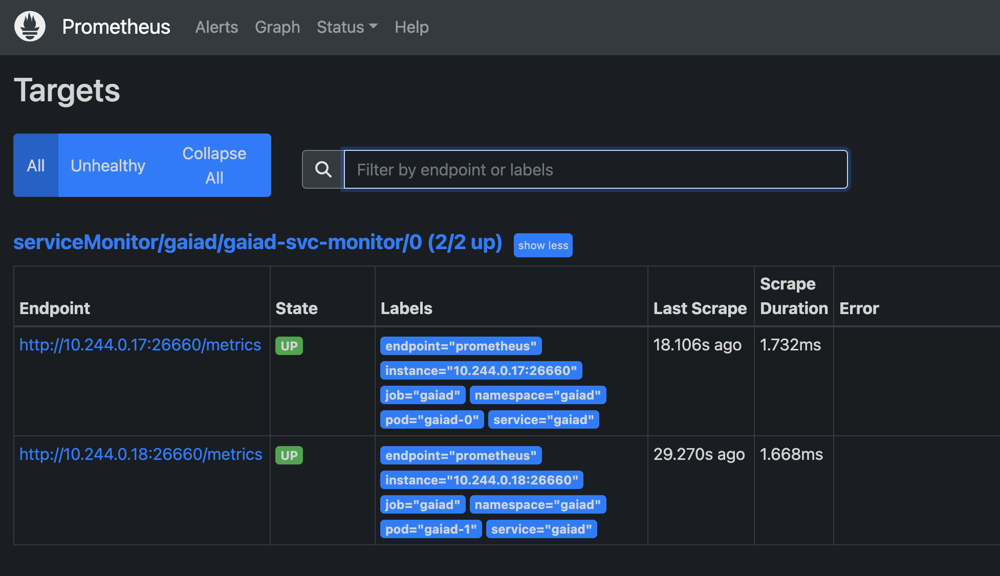

# Crypto Devops Test

## 1. Dockerize:
Write a Dockerfile to run Cosmos Gaia v7.1.0 (https://github.com/cosmos/gaia) in a container. It should download the source code, build it and run without any modifiers (i.e. docker run somerepo/gaia:v7.1.0 should run the daemon) as well as print its output to the console. The build should be security conscious (and ideally pass a container image security test such as Anchor). [20 pts]

> Pull this repo and build the container. Tag it `gaiad`, if you please:
```
$ git clone https://github.com/grggls/crypto-devops-test
$ cd crypto-devops-test
$ docker build -t gaiad .
```

> Jump into the anchore directory and bring up that service. You'll need to wait 10+ for all the feeds to finish downoading:
```
$ cd anchore
$ docker-compose up -d
$ docker-compose ps
NAME                      COMMAND                  SERVICE             STATUS              PORTS
anchore-analyzer-1        "/docker-entrypoint.…"   analyzer            running (healthy)   8228/tcp
anchore-api-1             "/docker-entrypoint.…"   api                 running (healthy)   0.0.0.0:8228->8228/tcp
anchore-catalog-1         "/docker-entrypoint.…"   catalog             running (healthy)   8228/tcp
anchore-db-1              "docker-entrypoint.s…"   db                  running (healthy)   5432/tcp
anchore-policy-engine-1   "/docker-entrypoint.…"   policy-engine       running (healthy)   8228/tcp
anchore-queue-1           "/docker-entrypoint.…"   queue               running (healthy)   8228/tcp

$ docker-compose exec api anchore-cli system feeds list
Feed                   Group                  LastSync                    RecordCount
vulnerabilities        alpine:3.10            2023-01-14T05:50:54Z        2331
vulnerabilities        alpine:3.11            2023-01-14T05:50:54Z        2665
vulnerabilities        alpine:3.12            2023-01-14T05:50:54Z        3205
vulnerabilities        alpine:3.13            2023-01-14T05:50:54Z        3684
vulnerabilities        alpine:3.14            2023-01-14T05:50:54Z        4173
vulnerabilities        alpine:3.15            2023-01-14T05:50:54Z        4591
vulnerabilities        alpine:3.16            2023-01-14T05:50:54Z        4942
...
...
```

> In the meantime, push your `gaiad` image to a registry:
```
$ docker tag gaiad grggls/gaiad:latest
$ docker push grggls/gaiad:latest
The push refers to repository [docker.io/grggls/gaiad]
caf120581354: Pushed
5a2d59dfed5a: Pushed
8849ba573d59: Pushed
...
...
latest: digest: sha256:593e91096f70543c9d5f3c164277f9516a78f016ac607c6519814ecc743bbf20 size: 2425
```

> Add your `gaiad` image to Anchore:
```
$ cd ..
$ docker-compose exec api anchore-cli image add grggls/gaiad:latest
Image Digest: sha256:593e91096f70543c9d5f3c164277f9516a78f016ac607c6519814ecc743bbf20
Parent Digest: sha256:593e91096f70543c9d5f3c164277f9516a78f016ac607c6519814ecc743bbf20
Analysis Status: not_analyzed
Image Type: docker
Analyzed At: None
Image ID: 004253f149da5c9a8380440bc83a3bbbbe63d195bec10b181106680b2d8d691a
Dockerfile Mode: None
Distro: None
Distro Version: None
Size: None
Architecture: None
Layer Count: None

Full Tag: docker.io/grggls/gaiad:latest
Tag Detected At: 2023-01-15T12:03:27Z

$ docker-compose exec api anchore-cli image vuln grggls/gaiad:latest all
Vulnerability ID        Package                         Severity        Fix              CVE Refs              Vulnerability URL                                                   Type        Feed Group         Package Path
CVE-2020-35467          docs-1.0.0                      Critical        None             CVE-2020-35467        https://nvd.nist.gov/vuln/detail/CVE-2020-35467                     npm         nvd                /go/pkg/mod/github.com/cosmos/cosmos-sdk@v0.45.9/docs/package.json
CVE-2020-35467          docs-1.0.0                      Critical        None             CVE-2020-35467        https://nvd.nist.gov/vuln/detail/CVE-2020-35467                     npm         nvd                /go/pkg/mod/github.com/cosmos/ibc-go/v3@v3.0.0/docs/package.json
CVE-2020-35467          docs-1.0.0                      Critical        None             CVE-2020-35467        https://nvd.nist.gov/vuln/detail/CVE-2020-35467                     npm         nvd                /go/pkg/mod/github.com/tendermint/tendermint@v0.34.21/docs/package.json
CVE-2022-28391          busybox-1.35.0-r29              High            1.35.0-r7        CVE-2022-28391        http://cve.mitre.org/cgi-bin/cvename.cgi?name=CVE-2022-28391        APKG        alpine:3.17        pkgdb
CVE-2022-28391          busybox-binsh-1.35.0-r29        High            1.35.0-r7        CVE-2022-28391        http://cve.mitre.org/cgi-bin/cvename.cgi?name=CVE-2022-28391        APKG        alpine:3.17        pkgdb
CVE-2022-28391          ssl_client-1.35.0-r29           High            1.35.0-r7        CVE-2022-28391        http://cve.mitre.org/cgi-bin/cvename.cgi?name=CVE-2022-28391        APKG        alpine:3.17        pkgdb
```

> Upgraded the `golang:alpine` image in use as `gaiad-builder` in the buildchain. Confirmed that the solution still works and `gaiad` is running nominally. Ran it through anchore again and got a clean bill of health:
```
$ docker-compose exec api anchore-cli evaluate check grggls/gaiad:latest
Image Digest: sha256:128b029a000d29351020c9ef54f3d59fce377bd6d42db1e69d3751d8b8589c8c
Full Tag: docker.io/grggls/gaiad:latest
Status: pass
Last Eval: 2023-01-15T12:30:20Z
Policy ID: 2c53a13c-1765-11e8-82ef-23527761d060
```

## 2. k8s FTW: Write a Kubernetes StatefulSet to run the above, using persistent volume claims and resource limits. [15 pts]

> Build a kind cluster with a local filesystem mount inside, then apply the k8s config for a volume and StatefulSet.
```
$ kind create cluster --config kind.yaml
Creating cluster "gaia" ...
 ✓ Ensuring node image (kindest/node:v1.25.3) 🖼
 ✓ Preparing nodes 📦
 ✓ Writing configuration 📜
 ✓ Starting control-plane 🕹️
 ✓ Installing CNI 🔌
 ✓ Installing StorageClass 💾
Set kubectl context to "kind-gaia"
You can now use your cluster with:

kubectl cluster-info --context kind-gaia
 
$ kubectl apply -f ./statefulset.yaml
namespace/gaiad created
service/gaiad created
persistentvolume/pv-gaia unchanged
persistentvolumeclaim/pvc-gaia created
statefulset.apps/gaiad created

$ kubectl get pods -n gaiad
NAME      READY   STATUS    RESTARTS   AGE
gaiad-0   1/1     Running   0          15m
gaiad-1   1/1     Running   0          15m

$ kubectl get pvc -n gaiad
NAME               STATUS    VOLUME                                     CAPACITY   ACCESS MODES   STORAGECLASS   AGE
pvc-gaia           Pending                                                                        standard       36s
pvc-gaia-gaiad-0   Bound     pvc-835d9388-81b9-4993-9f97-f953977f5d76   1Gi        RWO            standard       36s
pvc-gaia-gaiad-1   Bound     pvc-dd5135d8-9239-447f-a9cc-2e73b0fb0c76   1Gi        RWO            standard       28s

$ kubectl describe statefulset/gaiad -n gaiad
Name:               gaiad
Namespace:          gaiad
CreationTimestamp:  Mon, 16 Jan 2023 10:15:37 +1100
Selector:           app=gaiad
Labels:             <none>
Annotations:        <none>
Replicas:           2 desired | 2 total
Update Strategy:    RollingUpdate
  Partition:        0
Pods Status:        2 Running / 0 Waiting / 0 Succeeded / 0 Failed
Pod Template:
  Labels:  app=gaiad
  Containers:
   gaiad:
    Image:        grggls/gaiad:latest
    Port:         <none>
    Host Port:    <none>
    Environment:  <none>
    Mounts:       <none>
  Volumes:        <none>
Volume Claims:
  Name:          pvc-gaia
  StorageClass:
  Labels:        <none>
  Annotations:   <none>
  Capacity:      1Gi
  Access Modes:  [ReadWriteOnce]
Events:
  Type    Reason            Age   From                    Message
  ----    ------            ----  ----                    -------
  Normal  SuccessfulCreate  11m   statefulset-controller  create Claim pvc-gaia-gaiad-0 Pod gaiad-0 in StatefulSet gaiad success
  Normal  SuccessfulCreate  11m   statefulset-controller  create Pod gaiad-0 in StatefulSet gaiad successful
  Normal  SuccessfulCreate  11m   statefulset-controller  create Claim pvc-gaia-gaiad-1 Pod gaiad-1 in StatefulSet gaiad success
  Normal  SuccessfulCreate  11m   statefulset-controller  create Pod gaiad-1 in StatefulSet gaiad successful
```

3. All the observabilities: Alter the Gaia config file to enable prometheus metrics. Create a prometheus config or ServiceMonitor k8s resource to scrape the endpoint. [15 pts]

> Enable prometheus metrics in the gaiad containers by updating the `config.toml`. Build a new version of the container and push it to Docker hub. We enabled rolling updates in our `StatefulSet`, so kill off one pod at a time to update them:
```
$ kubectl describe pod/gaiad-0 -n gaiad | grep Image
    Image:          grggls/gaiad:latest
    Image ID:       docker.io/grggls/gaiad@sha256:128b029a000d29351020c9ef54f3d59fce377bd6d42db1e69d3751d8b8589c8c

$ kubectl delete pod/gaiad-0 -n gaiad
pod "gaiad-0" deleted

$ kubectl describe pod/gaiad-0 -n gaiad | grep Image
    Image:          grggls/gaiad:latest
    Image ID:       docker.io/grggls/gaiad@sha256:3a4715a94a70d672c03e40c1a4d8dd215a3c83e88d33851347cb01a5fef8e86f
```
> Repeat the process with the other container(s) in the StatefulSet and confirm they're running the latest version. Soon you'll be able to confirm that prometheus metrics are being exported from your pods:
```
$ kubectl get service -n gaiad
NAME    TYPE        CLUSTER-IP   EXTERNAL-IP   PORT(S)                                  AGE
gaiad   ClusterIP   None         <none>        26656/TCP,26657/TCP,1317/TCP,26660/TCP   7h4m

$ kubectl port-forward svc/gaiad -n gaiad 26660:26660
Forwarding from 127.0.0.1:26660 -> 26660
Forwarding from [::1]:26660 -> 26660
Handling connection for 26660
Handling connection for 26660

$ curl -s localhost:26660 | head
# HELP go_gc_duration_seconds A summary of the pause duration of garbage collection cycles.
# TYPE go_gc_duration_seconds summary
go_gc_duration_seconds{quantile="0"} 2.5441e-05
go_gc_duration_seconds{quantile="0.25"} 7.0512e-05
go_gc_duration_seconds{quantile="0.5"} 0.000125282
go_gc_duration_seconds{quantile="0.75"} 0.000200371
go_gc_duration_seconds{quantile="1"} 0.000487721
go_gc_duration_seconds_sum 0.003618512
go_gc_duration_seconds_count 24
```

> Install the Prometheus Operator into the Kind cluster using the procedure in https://github.com/prometheus-operator/prometheus-operator/blob/main/Documentation/user-guides/getting-started.md. Chose the Operator over the Helm chart for `kube-prometheus-stack` to reduce the number of moving parts to configure.
```
$ LATEST=$(curl -s https://api.github.com/repos/prometheus-operator/prometheus-operator/releases/latest | jq -cr .tag_name)
$ curl -sL https://github.com/prometheus-operator/prometheus-operator/releases/download/$LATEST/bundle.yaml | kubectl create -f -
customresourcedefinition.apiextensions.k8s.io/alertmanagerconfigs.monitoring.coreos.com created
customresourcedefinition.apiextensions.k8s.io/alertmanagers.monitoring.coreos.com created
customresourcedefinition.apiextensions.k8s.io/podmonitors.monitoring.coreos.com created
customresourcedefinition.apiextensions.k8s.io/probes.monitoring.coreos.com created
customresourcedefinition.apiextensions.k8s.io/prometheuses.monitoring.coreos.com created
customresourcedefinition.apiextensions.k8s.io/prometheusrules.monitoring.coreos.com created
customresourcedefinition.apiextensions.k8s.io/servicemonitors.monitoring.coreos.com created
customresourcedefinition.apiextensions.k8s.io/thanosrulers.monitoring.coreos.com created
clusterrolebinding.rbac.authorization.k8s.io/prometheus-operator created
clusterrole.rbac.authorization.k8s.io/prometheus-operator created
deployment.apps/prometheus-operator created
serviceaccount/prometheus-operator created
service/prometheus-operator created

$  kubectl get all
NAME                                       READY   STATUS    RESTARTS   AGE
pod/prometheus-operator-57df45d67c-x2h4t   1/1     Running   0          3m18s

NAME                          TYPE        CLUSTER-IP   EXTERNAL-IP   PORT(S)    AGE
service/kubernetes            ClusterIP   10.96.0.1    <none>        443/TCP    5h15m
service/prometheus-operator   ClusterIP   None         <none>        8080/TCP   3m18s

NAME                                  READY   UP-TO-DATE   AVAILABLE   AGE
deployment.apps/prometheus-operator   1/1     1            1           3m18s

NAME                                             DESIRED   CURRENT   READY   AGE
replicaset.apps/prometheus-operator-57df45d67c   1         1         1       3m18s
```
> Do the further configuration of Prometheus service accounts, cluster role, prometheus instance, etc. found here https://blog.container-solutions.com/prometheus-operator-beginners-guide

> Most importantly, create the service monitor for the gaiad service:
```
$ tail -14 prometheus.yaml
---
apiVersion: monitoring.coreos.com/v1
kind: ServiceMonitor
metadata:
  name: gaiad-svc-monitor
  namespace: gaiad
  labels:
    name: gaiad-svc-monitor
spec:
  selector:
    matchLabels:
      app: "gaiad"
  endpoints:
    - port: prometheus

$ kubectl apply -f prometheus.yaml
serviceaccount/prometheus created
clusterrole.rbac.authorization.k8s.io/prometheus created
clusterrolebinding.rbac.authorization.k8s.io/prometheus created
prometheus.monitoring.coreos.com/prometheus created
servicemonitor.monitoring.coreos.com/prometheus unchanged

$ kubectl get prometheus
kubectl get prometheus
NAME         VERSION   DESIRED   READY   RECONCILED   AVAILABLE   AGE
prometheus                       1       True         True        52s

$ kubectl get prometheus
NAME         VERSION   DESIRED   READY   RECONCILED   AVAILABLE   AGE
prometheus                       1       True         True        71s

$ kubectl get pods
NAME                                   READY   STATUS    RESTARTS   AGE
prometheus-operator-57df45d67c-x2h4t   1/1     Running   0          130m
prometheus-prometheus-0                2/2     Running   0
```

> Pull up the Prometheus instance and confirm that it's scraping the gaiad endpoints you recently configured
```
$ kubectl get service
NAME                  TYPE        CLUSTER-IP   EXTERNAL-IP   PORT(S)    AGE
kubernetes            ClusterIP   10.96.0.1    <none>        443/TCP    7h24m
prometheus-operated   ClusterIP   None         <none>        9090/TCP   2m42s
prometheus-operator   ClusterIP   None         <none>        8080/TCP   132m

$ kubectl port-forward svc/prometheus-operated 9090:9090
Forwarding from 127.0.0.1:9090 -> 9090
Forwarding from [::1]:9090 -> 9090
Handling connection for 9090
```



## 4. Script kiddies: Source or come up with a text manipulation problem and solve it with at least two of awk, sed, tr and / or grep. Check the question below first though, maybe. [10pts]

> Added `bitcoin.txt` (the original bitcoin paper)  and `count.sh` - a script that counts up and prints the occurrence of each word.  
```
$ head bitcoin.txt
# Bitcoin: A Peer-to-Peer Electronic Cash System

Satoshi Nakamoto
satoshin@gmx.com
www.bitcoin.org

**Abstract.** A purely peer-to-peer version of electronic cash

$ ./count.sh | head
'': 211
'"An': 1
'"Design': 1
'"Hashcash': 1
'"How': 1
'"Improving': 1
'"Protocols': 1
'"Secure': 1
'"b-money,"': 1
'"tape",': 1
```
## 5. Script grown-ups: Solve the problem in question 4 using any programming language you like. [15pts]

> Wrote a bit of python code (`count.py`) to do a similar bit of work to the script above.
```
$ python ./count.py | cut -c1-200
{'#': 1, 'Bitcoin:': 1, 'A': 8, 'Peer-to-Peer': 1, 'Electronic': 1, 'Cash': 1, 'System': 1, 'Satoshi': 1, 'Nakamoto': 1, 'satoshin@gmx.com': 1, 'www.bitcoin.org': 1, '**Abstract.**': 1, 'purely': 1, '
```

## 6. Terraform lovers unite: write a Terraform module that creates the following resources in IAM;
- A role, with no permissions, which can be assumed by users within the same account,
- A policy, allowing users / entities to assume the above role,
- A group, with the above policy attached,
- A user, belonging to the above group.

All four entities should have the same name, or be similarly named in some meaningful way given the context e.g. prod-ci-role, prod-ci-policy, prod-ci-group, prod-ci-user; or just prod-ci. Make the suffixes toggleable, if you like. [25pts]

> This directory has a terraform `main.tf` file in it. Real AWS credential will need to be added for this to be testable:
```
terraform {
  required_providers {
    aws = {
      source = "hashicorp/aws"
    }
  }
}

# Configure the AWS Provider
provider "aws" {
  region     = "ap-southeast-2"
  access_key = "AKIA1234567890123456"
  secret_key = "qwertyabcdefghijklmnopqr0x10101"
}
module "prod-ci-module" {
  source = "./terraform-module"
}
```
> The source `./terraform-module` directory contains the solution to this document. This was a quick and dirty solution to the Challenge. Making roles and policies in terraform requires much more thorough policy, review, and care. Credentials shouldn't be stored in source. Auditability requires that permission changes, users, access rights require review and documentation, etc.
